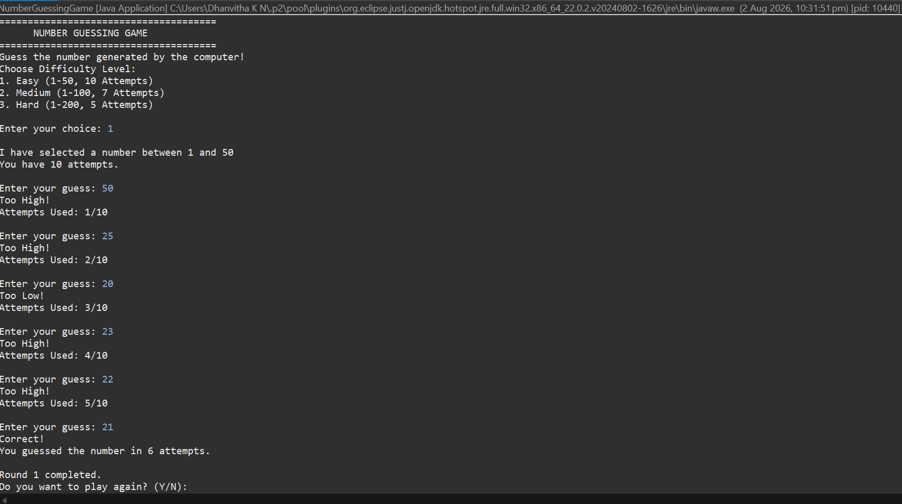
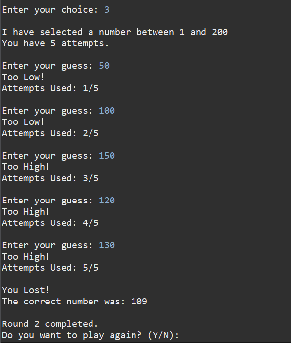
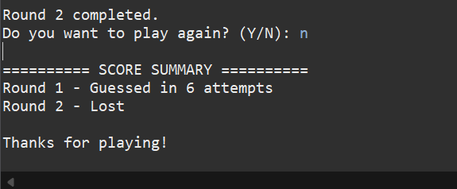

# 🎯 Number Guessing Game

## 📌 Description

The Number Guessing Game is a Java console application developed as part of the Oasis Infobyte Java Development Internship. The game generates a random number, and the player must guess it within a limited number of attempts. The game provides hints after each guess and supports multiple difficulty levels, multiple rounds, and score tracking.

---

## 🚀 Features

- 🎲 Random number generation
- 🎮 Three difficulty levels
  - Easy (1–50, 10 attempts)
  - Medium (1–100, 7 attempts)
  - Hard (1–200, 5 attempts)
- ⬆️ Too High / ⬇️ Too Low hints
- ✅ Correct guess detection
- 🔢 Attempt counter
- ❌ Maximum attempt limit
- 🔁 Play Again option
- 📊 Round-wise score summary
- 💻 Console-based user interface

---

## 🛠️ Technologies Used

- Java
- Eclipse IDE
- Scanner
- Random
- Core Java

---

## 📂 Project Structure

```
Java-Task2-NumberGuessingGame
│
├── src
│   └── com.oasis.game
│       └── NumberGuessingGame.java
│
├── screenshots
│
└── README.md
```

---

## ▶️ How to Run

1. Open the project in Eclipse.
2. Run `NumberGuessingGame.java`.
3. Select a difficulty level.
4. Guess the generated number.
5. Play multiple rounds and view your score summary.

---
## 📸 Screenshots

### Winning the Game



---

### Losing the Game



---

### Score Summary


---

## 👩‍💻 Author

**Dhanvitha K N**

Java Development Intern – Oasis Infobyte